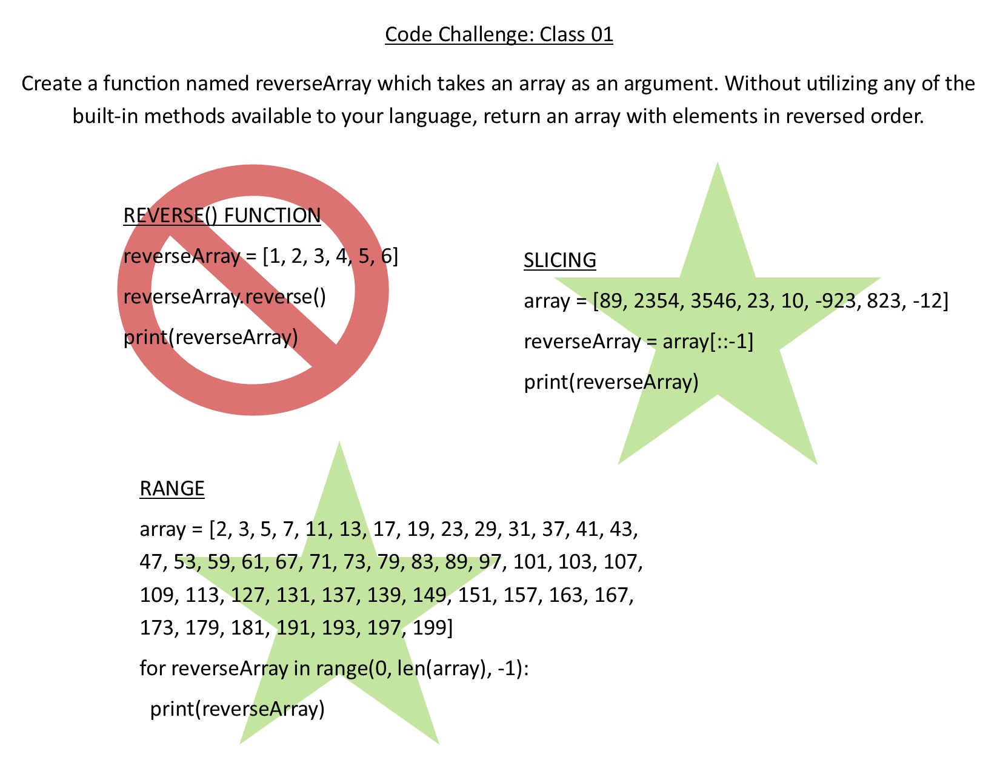

# Reverse an Array
Write a function called reverseArray which takes an array as an argument. Without utilizing any of the built-in methods available to your language, return an array with elements in reversed order.

## Challenge
Without utilizing any of the built-in methods available to your language, return an array with elements in reversed order.

## Approach & Efficiency
I took three approaches. Two valid and one invalid. The two valid approaches were slicing and using range. The invalid method used the built-in reverse() function.

## Solution

